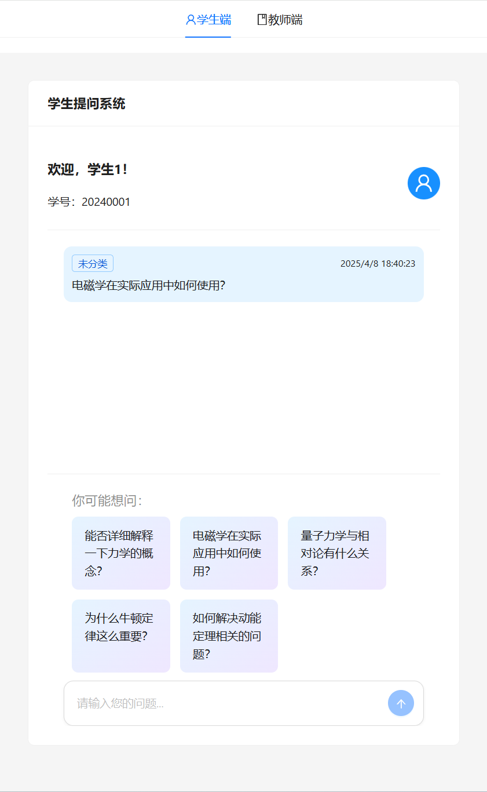
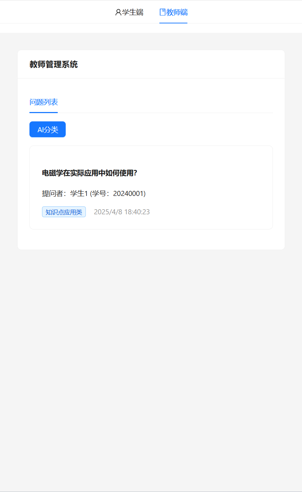

## introduction

时间:4小时
技术:不限
目的:用AI快速实现一个课堂互动系统，激发孩子在课堂上勇于提问智能体:能够实现简单的问题分类和问题生成后端:链接智能体和前端，进行数据交互前端:

学生端 
1.提问:创建20-30个学生，每个学生提出一个问题发送至教师端 
教师端 

1.查看学生提问情况:显示所有学生提交的问题列表。每条问题包含字段:问题内容、学生姓名、学号
2.分类:点击“分类”按钮，AI根据学生提问内容自动分类(4-8个类型)例如: 
(1)知识点定义类问题:向心加速度的定义式是怎么推导出来的? 
(2)知识点应用类问题:牛顿第二定律怎么用在斜面滑块问题上? 
(3)知识点关联类问题:动能定理和机械能守恒定律有什么区别? 
评分标准: 
模块 
考察点: 
系统设计架构合理、信息收集完整
界面设计界面简洁美观、交互流畅、符合用户规范
功能实现功能完整、代码规范、算法逻辑清晰
AI模块:
区分不同类型问题的能力

## UI

